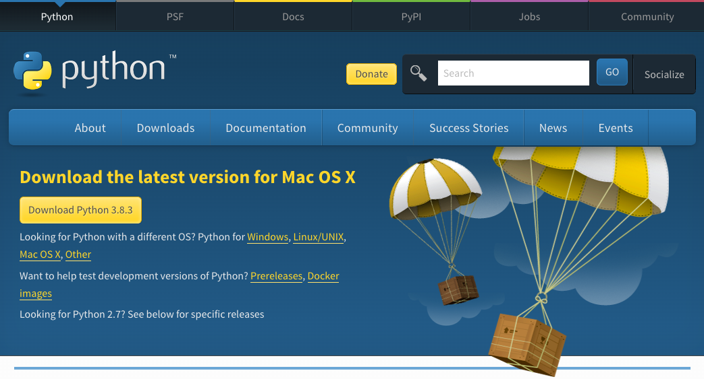

Hvis du ikke har Python 3 eller IDLE  installeret på din computer, følg instrukserne nedunder for dit operativ system:

+ [Microsoft Windows](#windows)
+ [macOS](#macos)
+ [Raspberry Pi OS and Linux](#linux)

## <a name="windows"></a> Microsoft Windows

Det anbefales at du [installerer Python via Microsoft Store](#windowsappstore). Hvis det ikke er muligt, kan du også [bruge en Python installer](#windowspythoninstall) fra [www.python.org](https://www.python.org).

### <a name="windowsappstore"></a>Microsoft Store (anbefalet)

+ Åben [Python 3.8 applikationen i Microsoft Store](ms-windows-store://pdp/?ProductId=9MSSZTT1N39L).

+ Tryk på **Get** knappen for at hente og installere Python 3.8.


+ Python 3.8 vil blive hentet og installeret. Fremgang vil vises som notifikation.


+ Når installationsprocess er færdig, vil en notifikation vises.


### <a name="windowspythoninstall"></a>Python installer

+ Åben din internet browser og gå ind på [www.python.org/downloads](https://www.python.org/downloads){:target="_blank"}.

+ På denne hjemmeside, kan du se en knap til at installere den seneste version af Python 3. Tryk på knappen og overførselen vil automatisk starte.


+ Try på `.exe` filen for at køre den. (Den vil være gemt i mappen `Overførsler`, eller hvorend din computer gemmer hentede filer.)


+ I dialogboksen der åbner, det er vigtigt at du markerer boksen ved siden af **Add Python 3 to PATH**.


+ Tryk på **Install Now** og følg installationsvejledningen. Installeringsprocessen vil tage lidt tid.


+ Når installeringsprocessen er færdig, tryk på **Done**, og luk så din web browser. Nu kan du gå til din windows start menu og bruge IDLE programmet.

## <a name="macos"></a> macOS

+ Åben din web browser og naviger til [www.python.org/downloads](https://www.python.org/downloads){:target="_blank"}.

+ På denne side vil du kunne se en knap der installerer den seneste version af Python 3. Tryk på knappen og en download vil automatisk starte.



+ Tryk på download i dokken for at starte installationsprocessen.


+ Tryk på **Continue** og følg installationsvejledningen. Installationen kan tage lidt tid.


+ Når installationsprocessen er færdig, tryk på **Close**.

+ Åben IDLE programmet fra dine Applikationer.

## <a name="linux"></a> Raspberry Pi OS og andre Linux (Debian-based) distributioner

De fleste distributioner af Linux kommer med Python 3 allerede installeret, men de har måske ikke IDLE, den almindelige interaktive udviklings miljøprogram, installeret.

Brug `apt` for at tjekke om de er installeret og installer dem hvis de ikke er.

+ Brug en terminal og skriv:

```
sudo apt update
sudo apt install python3 idle3
```

Dette vil installere Python 3 (og IDLE), og så skulle du kunne finde den i din Applikationsmenu.
