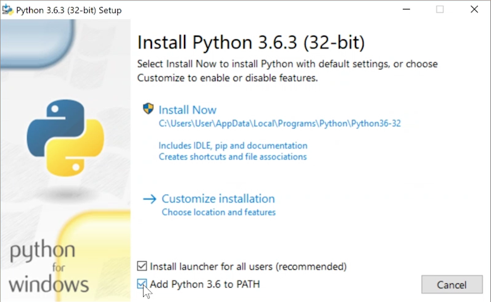

If Python 3 or IDLE isn't installed on you computer, follow the installation instructions below for your operating system.

### Microsoft Windows

On Microsoft Windows, your first step will be to open up your web browser and navigate to [www.python.org/downloads](https://www.python.org/downloads).

On this webpage, you will see a button to install the latest version of Python 3. Click it, and a download of an executable file will start automatically. Click on the `.exe` file to run it — it will be saved in your `Downloads` folder, or whereever your computer saves downloaded files by default.



In the dialogue box that opens up, it is important to first tick the box next to **Add Python 3 to PATH** (see image above). Then you can go ahead and click **Install Now**. The setup process will take a little bit of time.

Once the setup is complete, click **Done** and then close your web browser. Now you can go to the start menu to open **IDLE**, a standard interactive development environment for writing and executing Python code which you will use in many of our Python projects.

### Apple macOS

To install Python on MacOS, you will first need to install Xcode. Open up your **App Store**, search for **Xcode**, and install it on your computer. This will take a few minutes.

Once Xcode has been installed, open up a web browser and navigate to [brew.sh](https://brew.sh), which is the homepage of **Homebrew**. This is a macOS package manager which is useful for installing a lot of different applications — you need it to install Python 3.

To install Homebrew, open a **terminal** window, and paste in the following line of code:

```
/usr/bin/ruby -e "$(curl -fsSL https://raw.githubusercontent.com/Homebrew/install/master/install)"
```

Press **Enter** to start the installation process for Homebrew. At various times during the process, you may be prompted for confirmations and your password.

Once Homebrew has been installed, type this into the terminal window:

```
brew install python3
```

This command will install Python 3 on your computer.

If you then have a look at your **Applications** folder, you might find that Python 3 is not there, or maybe it has a large question mark over the icon. To make sure that you can access the interactive development environment (or **IDLE**) of Python 3, go back to the terminal window and type:

```
brew linkapps
```

Now navigate to your Applications folder again, and you should find **IDLE 3** there. This programme is a standard interactive development environment for writing and executing Python code which you will use in many of our Python projects.

## Linux (Debian-based distributions)

Most distributions of Linux come with Python 3 already installed, but they might not have IDLE installed. Use `apt` to check whether they are installed, and install if them if they aren't.

Open up a terminal window and type:

```
sudo apt update
sudo apt install python3 idle3
```

This will install IDLE (and Python 3), and you should then be able to find it in your Application menu.
