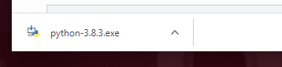
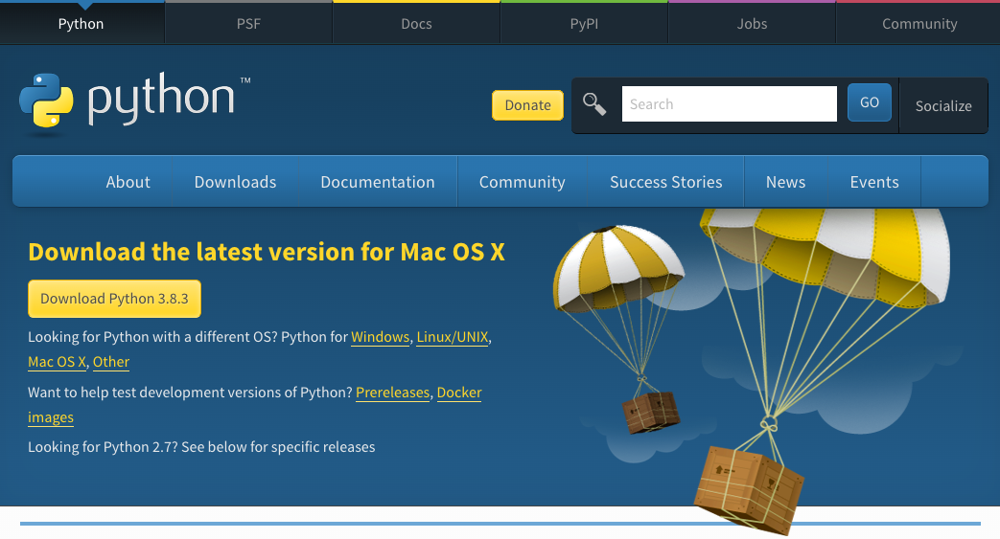
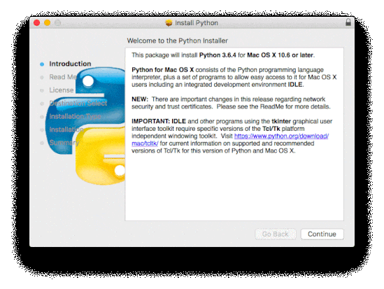

If Python 3 or IDLE isn't installed on you computer, follow the installation instructions below for your operating system:

+ [Windows](#windows)
+ [macOS](#macos)
+ [Raspberry Pi OS & Linux](#linux)

## <a name="windows"></a> Microsoft Windows

[Installing Python via the Microsoft App Store](#windowsappstore) is recommended. If this is not possible you can also [use a Python installation](#windowspythoninstall) from (python.org)[https://python.org].

### <a name="windowsappstore"></a>Microsoft App Store (recommended)

+ Open the [Python 3.8 application in the Microsoft Store](ms-windows-store://pdp/?ProductId=9MSSZTT1N39L)

+ Click the Get button to download and install Python 3.8


+ Python 3.8 will be downloaded and installed. Progress will be shown in the notification bar.


+ When the install is complete a notification will appear.


### <a name="windowspythoninstall"></a>Python installer

+ Open your web browser and navigate to [www.python.org/downloads](https://www.python.org/downloads).

+ On this webpage, you will see a button to install the latest version of Python 3. Click it, and a download will start automatically.


+ Click on the `.exe` file to run it. (It will have been saved in your `Downloads` folder, or wherever your computer saves downloaded files by default.)



+ In the dialogue box that opens up, it is important to first tick the box next to **Add Python 3 to PATH**. 


+ Click **Install Now** and follow the install guide. The setup process will take a little time.


+ Once the setup is complete, click **Done** and then close your web browser. Now you can go to the start menu to open IDLE.

## <a name="macos"></a> macOS

+ Open your web browser and navigate to [www.python.org/downloads](https://www.python.org/downloads).

+ On this webpage, you will see a button to install the latest version of Python 3. Click it, and a download will start automatically.



+ Click on the download in the dock to start the installation process.


+ Click **Continue** and follow the installation guide. The installation may take a little time.



+ When it's complete, click **Close**.

+ Open IDLE from your Applications.

## <a name="linux"></a> Raspberry Pi OS & other Linux (Debian-based) distributions

Most distributions of Linux come with Python 3 already installed, but they might not have default IDLE IDE installed. Use `apt` to check whether they are installed and install if them if they aren't.

+ Open up a terminal window and type:

```
sudo apt update
sudo apt install python3 idle3
```

This will install Python 3 (and IDLE), and you should then be able to find it in your Application menu.
