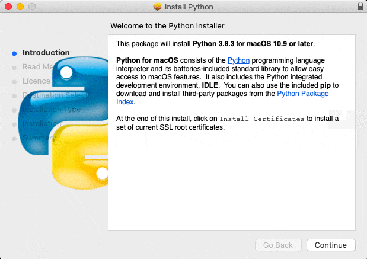

Si Python 3 o IDLE no están instalados en tu computador, sigue las instrucciones de instalación a continuación para tu sistema operativo:

+ [Microsoft Windows](#windows)
+ [macOS](#macos)
+ [Sistema operativo Raspberry Pi y Linux](#linux)

## <a name="windows"></a> Microsoft Windows

Se recomienda que [instales Python a través de Microsoft Store](#windowsappstore). Si esto no es posible, también puedes [usar un instalador de Python](#windowspythoninstall) desde [www.python.org](https://www.python.org).

### <a name="windowsappstore"></a>Microsoft Store (recomendado)

+ Abre la [aplicación Python 3.8 en Microsoft Store](ms-windows-store://pdp/?ProductId=9MSSZTT1N39L).

+ Haz clic en el botón **Obtener** para descargar e instalar Python 3.8.


+ Python 3.8. se descargará e instalará. El progreso se mostrará en la barra de notificaciones.


+ Una vez finalizado el proceso de instalación, aparecerá una notificación.


### <a name="windowspythoninstall"></a>Instalador de Python

+ Abre tu navegador web y navega a [www.python.org/downloads](https://www.python.org/downloads){:target="_blank"}.

+ En esta página web, verás un botón para instalar la última versión de Python 3. Haz clic en el botón y una descarga se iniciará automáticamente.


+ Haz clic en el archivo `.exe` para ejecutarlo. (Se guardará en la carpeta de `Descargas`, o en donde tu computador guarda los archivos descargados por defecto)


+ En el cuadro de diálogo que se abre, es importante que primero marques la casilla junto a **Agregar Python 3 a PATH**.


+ Haz clic en **Instalar ahora** y sigue la guía de instalación. El proceso de configuración tomará un poco de tiempo.


+ Una vez finalizada la configuración, haz clic en **Listo** y cierra tu navegador web. Ahora puedes ir al menú Inicio para abrir IDLE.

## <a name="macos"></a> macOS

+ Abre tu navegador web y navega a [www.python.org/downloads](https://www.python.org/downloads){:target="_blank"}.

+ En esta página web, verás un botón para instalar la última versión de Python 3. Haz clic en el botón y una descarga se iniciará automáticamente.


+ Haz clic en la descarga en el dock para iniciar el proceso de instalación.


+ Haz clic en **Continuar** y sigue la guía de instalación. La instalación puede demorar un poco.



+ Cuando el proceso de instalación haya finalizado, haz clic en **Cerrar**.

+ Abre IDLE desde tus aplicaciones.

## <a name="linux"></a> Sistema operativo Raspberry Pi y otras distribuciones Linux (basadas en Debian)

La mayoría de las distribuciones de Linux vienen con Python 3 ya instalado, pero es posible que no tengan IDLE, el IDE (entorno de desarrollo interactivo) predeterminado instalado.

Usa `apt` para comprobar si están instalados e instalarlos si no lo están.

+ Abre una ventana de terminal y escribe:

```
sudo apt update
sudo apt install python3 idle3
```

Esto instalará Python 3 (y IDLE), y luego deberías poder encontrarlo en el menú Aplicación.
