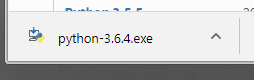
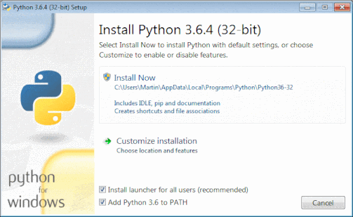
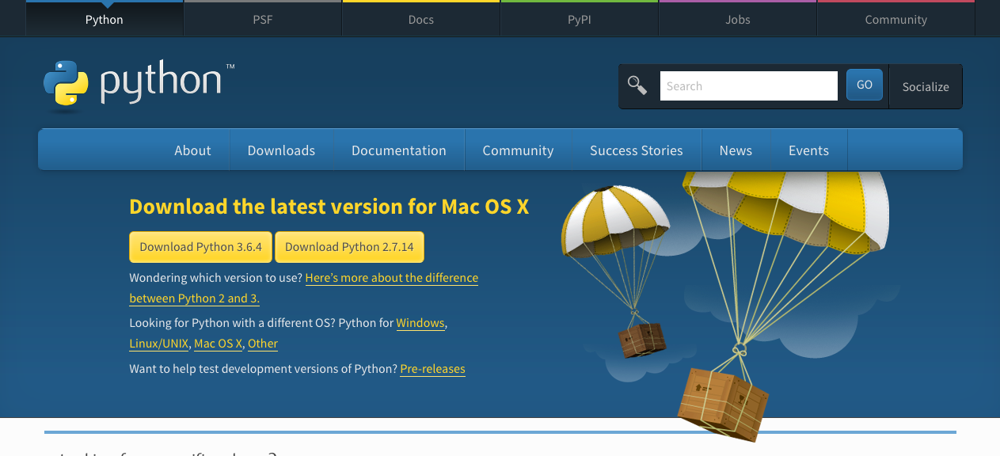
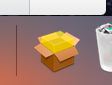

Als Python 3 of IDLE niet op je computer is geïnstalleerd, volg je de onderstaande installatie-instructies voor jouw besturingssysteem.

**IDLE** is een standaard interactieve ontwikkelomgeving voor het schrijven en uitvoeren van Python-code die je in veel van onze Python-projecten zult gebruiken.

### Microsoft Windows

+ Open je webbrowser en ga naar [www.python.org/downloads](https://www.python.org/downloads).

+ Op deze webpagina zie je een knop om de nieuwste versie van Python 3 te installeren. Klik erop en een download start automatisch.


+ Klik op het bestand `.exe` om het uit te voeren. (Het zal zijn opgeslagen in je map `Downloads`, of waar je computer standaard gedownloade bestanden opslaat.)



+ In het dialoogvenster dat wordt geopend, is het belangrijk om eerst het vakje naast **Python 3 toevoegen aan PATH** aan te vinken.


+ Klik op **Nu installeren** en volg de installatiehandleiding. Het installatieproces duurt even.



+ Nadat de installatie is voltooid, klik je op **Gereed** en sluit je je webbrowser. Nu kun je naar het startmenu gaan om IDLE te openen.

### macOS

+ Open je webbrowser en ga naar [www.python.org/downloads](https://www.python.org/downloads).

+ Op deze webpagina zie je een knop om de nieuwste versie van Python 3 te installeren. Klik erop en een download start automatisch.



+ Klik op de download in het dock om het installatieproces te starten.



+ Klik op **Doorgaan** en volg de installatiehandleiding. De installatie kan even duren.


+ Wanneer het voltooid is, klik je op **Sluiten**.

+ Open IDLE vanuit je applicaties.

### Linux (op Debian gebaseerde distributies)

Bij de meeste Linux-distributies wordt Python 3 al geïnstalleerd, maar IDLE is mogelijk niet geïnstalleerd. Gebruik `apt` om te controleren of ze zijn geïnstalleerd en installeer ze als ze dat niet zijn.

+ Open een terminalvenster en typ:

```
sudo apt update
sudo apt install python3 idle3
```

Hiermee wordt IDLE (en Python 3) geïnstalleerd en je zou het dan in je toepassingsmenu moeten kunnen vinden.
